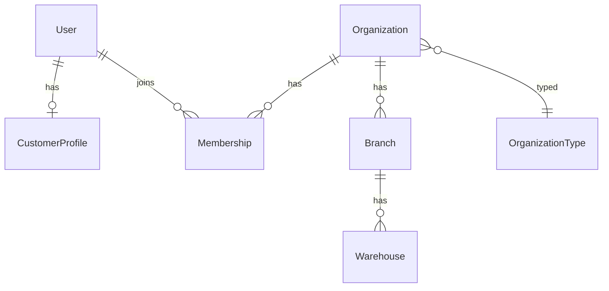
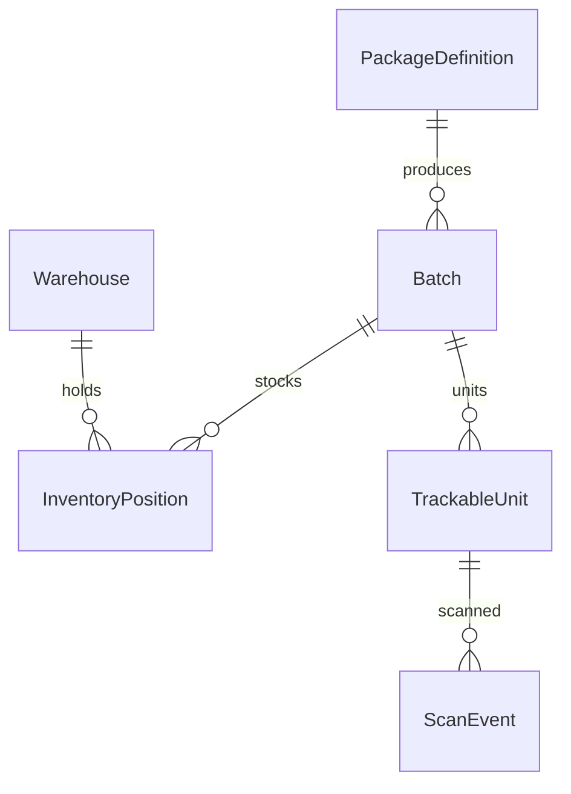
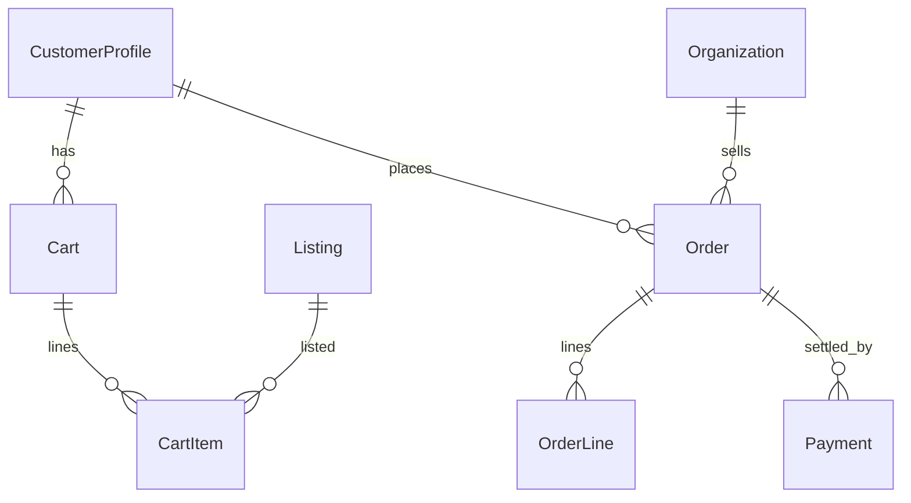
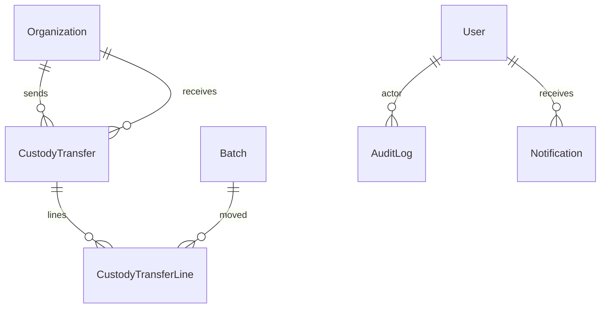

# ERD notes (final Prisma)

Canonical schema: `prisma/schema.prisma` (Steps 0–18 models).

This file tracks **logical groupings** for the release candidate. For exhaustive fields, open Prisma / Prisma Studio.

## Core identity & tenancy

## Catalog → batch → inventory → verification

## Marketplace & payments

## Supply chain & compliance

Legacy `Product` / `ProductUnit` / `ProductUnitAuditLog` remain for `ENABLE_LEGACY_MODULES` only and are **not** part of the Healthcare OS domain model.

See also: [domain-model.md](./domain-model.md), [sequence-diagrams.md](./sequence-diagrams.md).
