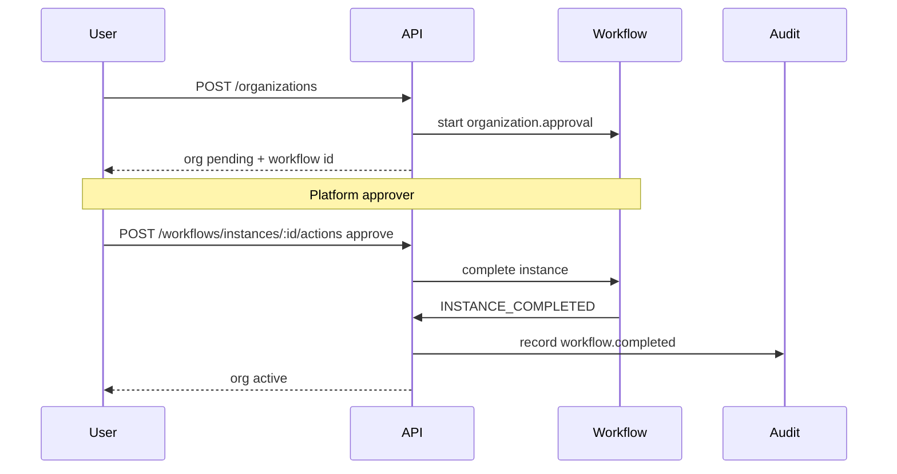
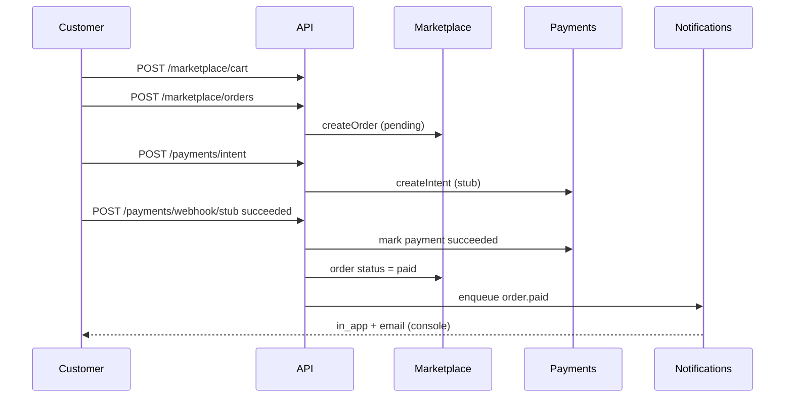
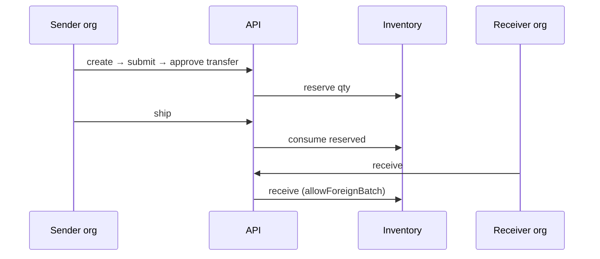
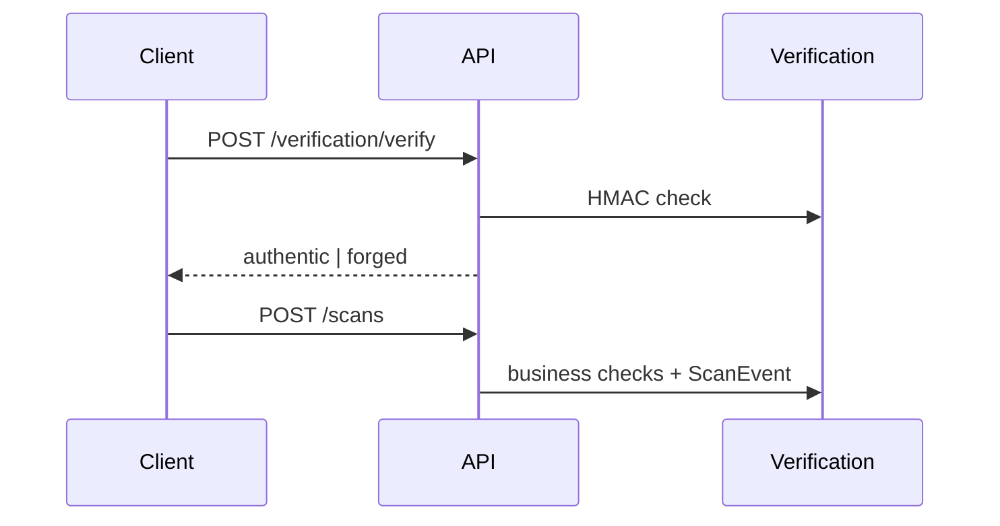

# Sequence diagrams (major flows)

## Org onboarding + approval

```mermaid
sequenceDiagram
  participant U as User
  participant API as API
  participant WF as Workflow
  participant AUD as Audit

  U->>API: POST /organizations
  API->>WF: start organization.approval
  API-->>U: org pending + workflow id
  Note over U,WF: Platform approver
  U->>API: POST /workflows/instances/:id/actions approve
  API->>WF: complete instance
  WF->>API: INSTANCE_COMPLETED
  API->>AUD: record workflow.completed
  API-->>U: org active
```

## Marketplace checkout + payment

```mermaid
sequenceDiagram
  participant C as Customer
  participant API as API
  participant MP as Marketplace
  participant Pay as Payments
  participant N as Notifications

  C->>API: POST /marketplace/cart
  C->>API: POST /marketplace/orders
  API->>MP: createOrder (pending)
  C->>API: POST /payments/intent
  API->>Pay: createIntent (stub)
  C->>API: POST /payments/webhook/stub succeeded
  API->>Pay: mark payment succeeded
  API->>MP: order status = paid
  API->>N: enqueue order.paid
  N-->>C: in_app + email (console)
```

## Custody transfer

```mermaid
sequenceDiagram
  participant S as Sender org
  participant API as API
  participant INV as Inventory
  participant R as Receiver org

  S->>API: create → submit → approve transfer
  API->>INV: reserve qty
  S->>API: ship
  API->>INV: consume reserved
  R->>API: receive
  API->>INV: receive (allowForeignBatch)
```

## Unit verify / scan

```mermaid
sequenceDiagram
  participant Client
  participant API
  participant Ver as Verification

  Client->>API: POST /verification/verify
  API->>Ver: HMAC check
  API-->>Client: authentic | forged
  Client->>API: POST /scans
  API->>Ver: business checks + ScanEvent
```
